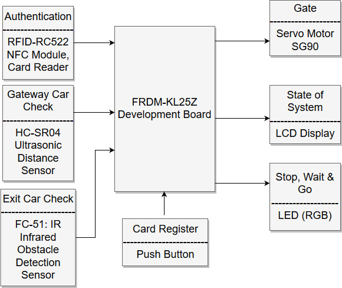

# Authentication-Required-Parking-Lot

Goal
====

The main purpose of the term project is to build a microcontroller-based
system. In order to have a didactic project creation period, it is
better to interact with different types of hardware during this process.
In this context, a simple parking lot gate control system found suitable
for the term project. Authentication required parking lots are very
common in daily life and needed almost in every facility. Due to
hierarchical order in many facilities it is useful to reserve some
parking lots to higher level individuals. As a solution for the given
problem, this term project focuses mainly on the creation of an
efficient authentication required parking lot system with the help of
the KL25Z microcontroller.

Requirements
============

The project must be a microcontroller-based system, so the designed
project will be operated through the FRDM-KL25Z Development Board. After
deciding the controller, it is crucial to design the working mechanism
of the system. As as authentication method, instead of distributing a
remote key to each and every individual, it is a better approach to make
them use their ID cards as gate keys. A card reading mechanism is the
optimal solution for the given problem. Some would prefer using
authentication even to leave the facility and it feasible for a single
entry single exit parking lot. However, in this project design,
authentication is only required for the entry and the exit part is
secured with one sided stop sticks. Then, the next step is controlling
the opening of the gate. A servo motor will be responsible for the
movement of the barrier gate. Since a ninety degree rotation is required
for the gate, a servo motor is more than sufficient to deliver the task.
Last but not least, the gate must stay in the upright position until the
car clears out the gateway to prevent any possible damage to the car. In
this manner, a photocell is the first solution comes to mind. However,
due to stock and shipment issues of the main distributors in the country
using photocells is not possible for the time allocated for the project.
Thus, a distance sensor will be used which can provide a similar
functionality while leaving room for enhancements. As a final touch, LCD
display and LEDs will be used to provide visual assistance to the users.

Components
==========

1.  FRDM-KL25Z Development Board

2.  LCD Display (16 x 2)

3.  RFID-RC522 NFC Module, Card Reader

4.  HC-SR04 Ultrasonic Distance Sensor

5.  Servo Motor SG90

6.  LED (Green, Red)

